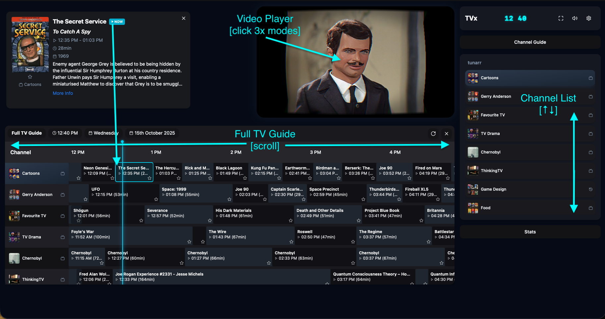
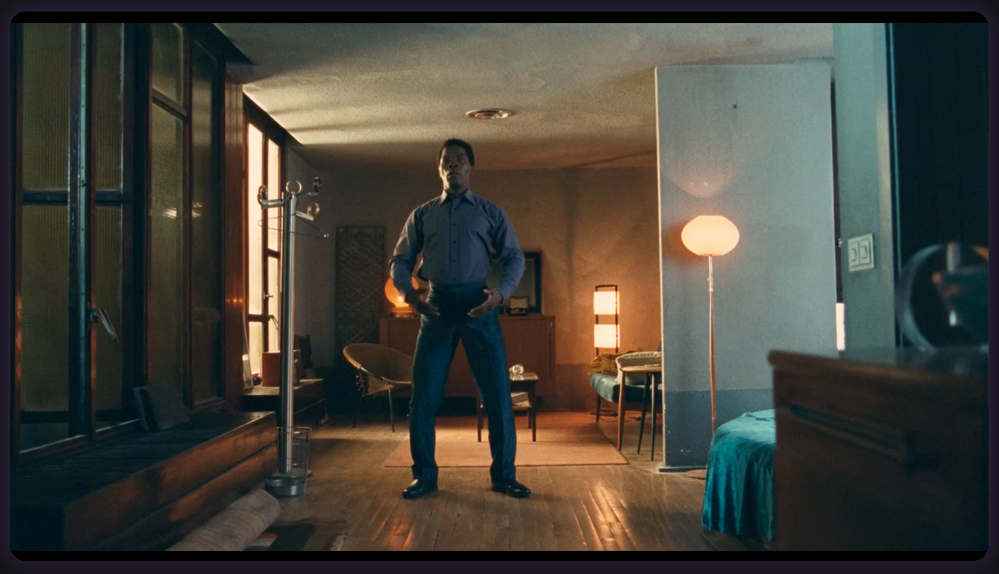

# Usage

## Getting Started

1. Ensure your Tunarr server is running and accessible
2. Set the `VITE_M3U_URL` and `VITE_XMLTV_URL` environment variables
3. Start TVx and open `http://localhost:8777`
4. Use arrow keys to browse channels

## Keyboard Shortcuts

| Key | Action |
|-----|--------|
| `↑` `↓` | Channel surf (hold to skim) |
| `G` | Toggle full TV guide |
| `F` | Fullscreen |
| `M` | Mute/Unmute |
| `Esc` | Close modals/Exit theater |

## Features

### Instant Channel Surfing

⚡ **Instant channel surfing** — tap ↑/↓ to skim through channels quickly. Hold the keys to rapidly browse, release when you find something interesting.

### TV Guide

- Press `G` to open the full TV guide
- Shows a 12-hour timeline across all channels
- Displays poster artwork for programs
- Click on any program to jump to that channel and time

### Theater Modes

- Click on the video player to cycle through views:
  - **Guide View**: Shows channel list and current program info
  - **Normal View**: Standard player with controls
  - **Immersive View**: Full screen player with minimal UI

### Smart Channel Names

🏷️ **Smarter Tunarr channel names** — TVx automatically cleans up channel names and adds relevant icons:

- *Pulp Fiction Movies* → Pulp Fiction [🎬]
- *The Hitchhiker's Guide to the Galaxy Shows* → The Hitchhiker's Guide to the Galaxy [📺]
- *Extreme Ironing Sports* → Extreme Ironing [🏆]
- *The Tesla Files History* → The Tesla Files [📜]
- *Cosmos Documentaries* → Cosmos [📜]

### Vintage TV Effects

TVx includes authentic CRT television effects:

- Curved glass and scanlines
- Chromatic aberration and vignette
- Toggle vintage filter on/off for different aesthetics

### VHS Buffering

When a stream loads, TVx displays a vintage VHS loading animation while disks spin up and content buffers.


## Screenshots

### Main View


### Theatre Mode


### Full TV Guide



### Keyboard Shortcuts Display


### Vintage TV Filter = On


### Vintage TV Filter = OFF



### VHS Buffering Video


## Browser Support

Works best in modern browsers with WebGL support:

- ✅ Chrome/Edge 90+
- ⚠️ Firefox 88+
- ✅ Safari 14+

## Troubleshooting

### Channels not loading

- Check that your M3U and XMLTV URLs are correct
- Ensure Tunarr is running and accessible
- Clear browser cache (Ctrl+Shift+R)

### Video not playing

- Verify HLS streams are working in Tunarr
- Check browser console for errors
- Try a different browser

### EPG not showing

- Confirm XMLTV URL is valid
- Check that XMLTV file contains program data
- Refresh the page

## Logging & Monitoring

TVx provides comprehensive logging of all user interactions directly to your Docker container logs, making it easy to monitor usage and troubleshoot issues.

### What Gets Logged

- **Channel Selection**: When channels are selected (including channel names and source)
- **Program Interactions**: Opening/closing program popups with show details and episode info
- **Poster Views**: Opening/closing program posters
- **Google Searches**: When "More Info" links are clicked (with show name and year)
- **Guide Navigation**: Opening/closing full TV guide and channel guide
- **Settings Changes**: All settings operations and modifications
- **File Operations**: M3U/XMLTV file uploads and parsing results
- **Video Controls**: Play/pause, mute/unmute, fullscreen toggles
- **UI Interactions**: Stats panel, favorites management, keyboard shortcuts
- **Errors**: All application errors and parsing failures

### Viewing Logs

**Docker Container Logs:**
```bash
docker logs tvx
```

**Docker Compose Logs:**
```bash
docker-compose logs -f tvx
```

**Unraid Logs:**
- Go to Docker tab → TVx container → Logs

### Sample Log Output

```log
[2025-10-15T20:18:28.467Z] INFO: Loaded 20 channels
[2025-10-15T20:18:28.481Z] INFO: Channel changed to: Favourite TV Shows
[2025-10-15T20:18:28.498Z] INFO: Loaded stream URL for Favourite TV Shows: http://192.168.22.2:8000/stream/channels/0136ef47-9ddc-468f-8f81-3b9bbe9e09ba?streamMode=hls
[2025-10-15T20:18:28.529Z] INFO: Loaded EPG data for 467 programmes
[2025-10-15T20:18:28.675Z] INFO: Loading video loaded successfully
[2025-10-15T20:18:28.680Z] INFO: Loading video started playing
[2025-10-15T20:18:31.008Z] INFO: Channel changed to: Gerry Anderson Shows
[2025-10-15T20:18:31.014Z] INFO: Loaded stream URL for Gerry Anderson Shows: http://192.168.22.2:8000/stream/channels/b460e1c6-d129-4146-ba60-ffd7a7d0f2ef?streamMode=hls
[2025-10-15T20:18:50.406Z] INFO: Channel changed to: Gerry Anderson Shows
[2025-10-15T20:18:50.484Z] INFO: Loading video started playing
```

### Benefits

This logging system helps you:

- Monitor viewing patterns and popular channels/programs
- Debug user interaction issues
- Track application usage in multi-user environments
- Verify that features are working correctly
- Analyze user behavior and preferences