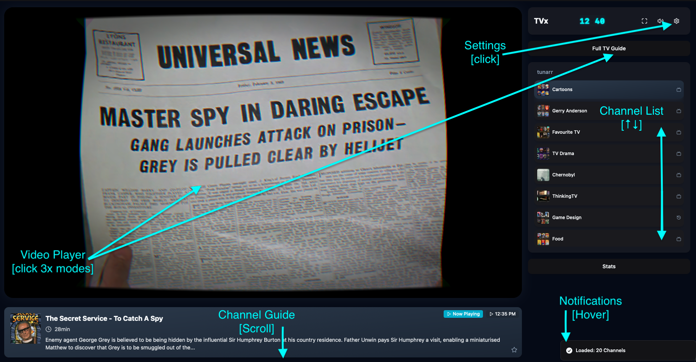
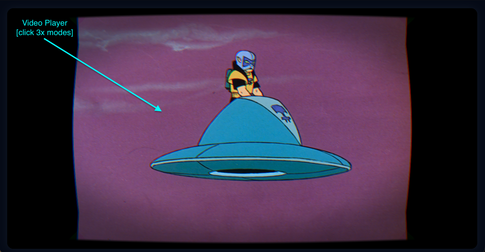
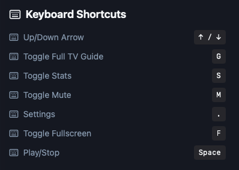
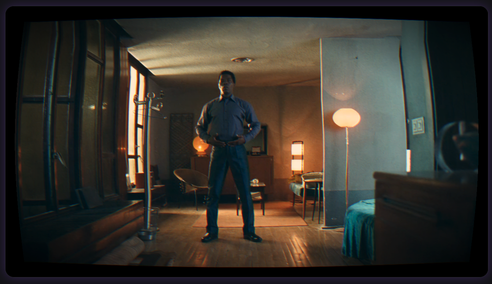
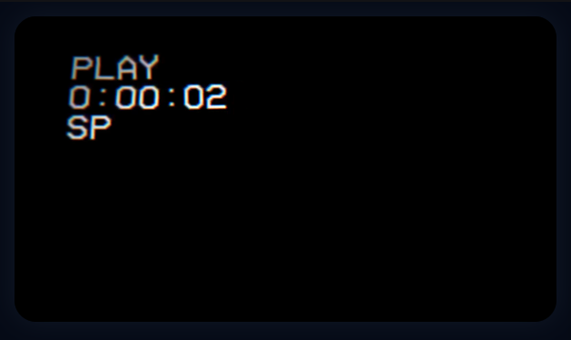

# Usage

## Getting Started

1. Ensure your Tunarr server is running and accessible
2. Set the `VITE_M3U_URL` and `VITE_XMLTV_URL` environment variables
3. Start TVx and open `http://localhost:8777`
4. Use arrow keys to browse channels

## Keyboard Shortcuts

| Key | Action |
|-----|--------|
| `↑` `↓` | Channel surf (hold to skim) |
| `G` | Toggle full TV guide |
| `F` | Fullscreen |
| `M` | Mute/Unmute |
| `Esc` | Close modals/Exit theater |

## Features

### Instant Channel Surfing

⚡ **Instant channel surfing** — tap ↑/↓ to skim through channels quickly. Hold the keys to rapidly browse, release when you find something interesting.

### TV Guide

- Press `G` to open the full TV guide
- Shows a 12-hour timeline across all channels
- Displays poster artwork for programs
- Click on any program to jump to that channel and time

### Theater Modes

- Click on the video player to cycle through views:
  - **Guide View**: Shows channel list and current program info
  - **Normal View**: Standard player with controls
  - **Immersive View**: Full screen player with minimal UI

### Smart Channel Names

🏷️ **Smarter Tunarr channel names** — TVx automatically cleans up channel names and adds relevant icons:

- *Pulp Fiction Movies* → Pulp Fiction [🎬]
- *The Hitchhiker's Guide to the Galaxy Shows* → The Hitchhiker's Guide to the Galaxy [📺]
- *Extreme Ironing Sports* → Extreme Ironing [🏆]
- *The Tesla Files History* → The Tesla Files [📜]
- *Cosmos Documentaries* → Cosmos [📜]

### Vintage TV Effects

TVx includes authentic CRT television effects:

- Curved glass and scanlines
- Chromatic aberration and vignette
- Toggle vintage filter on/off for different aesthetics

### VHS Buffering

When a stream loads, TVx displays a vintage VHS loading animation while disks spin up and content buffers.

## Screenshots

### Main View

### Theatre Mode

### Full TV Guide

### Keyboard Shortcuts Display

### Vintage TV Filter = On

### Vintage TV Filter = OFF

### VHS Buffering Video

## Browser Support

Works best in modern browsers with WebGL support:

- ✅ Chrome/Edge 90+
- ⚠️ Firefox 88+
- ✅ Safari 14+

## Troubleshooting

### Channels not loading

- Check that your M3U and XMLTV URLs are correct
- Ensure Tunarr is running and accessible
- Clear browser cache (Ctrl+Shift+R)

### Video not playing

- Verify HLS streams are working in Tunarr
- Check browser console for errors
- Try a different browser

### EPG not showing

- Confirm XMLTV URL is valid
- Check that XMLTV file contains program data
- Refresh the page

